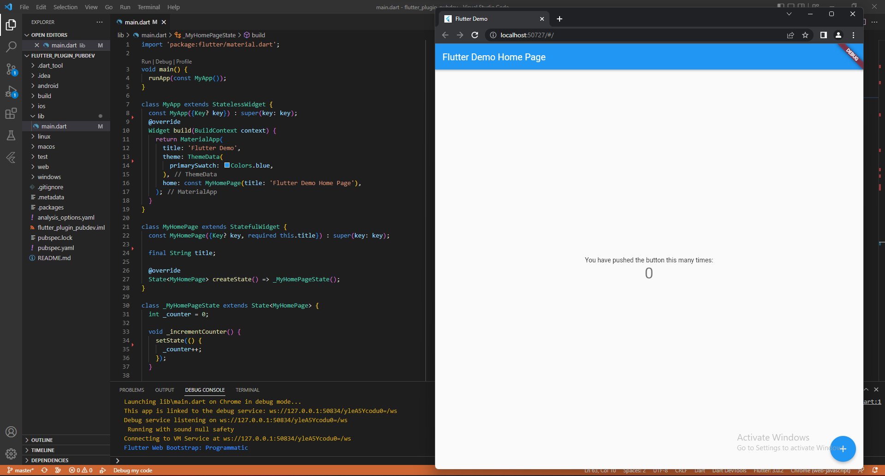
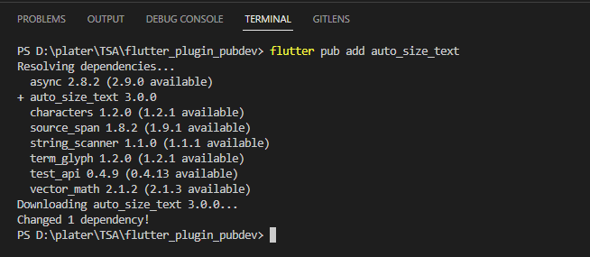
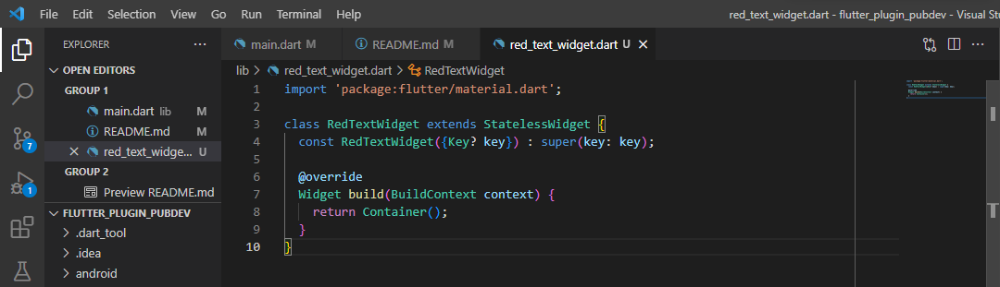
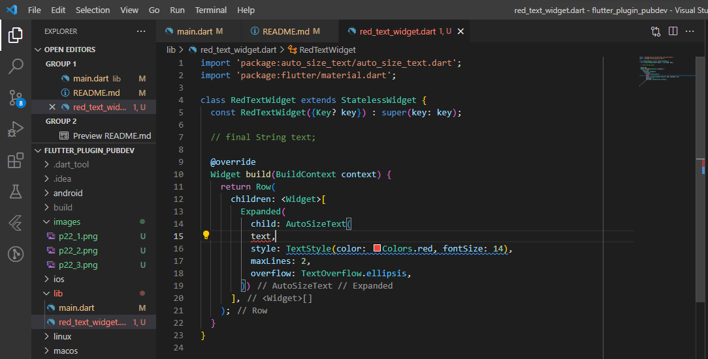
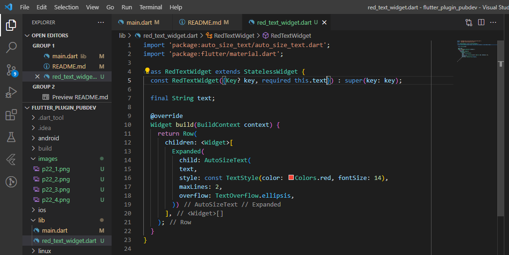
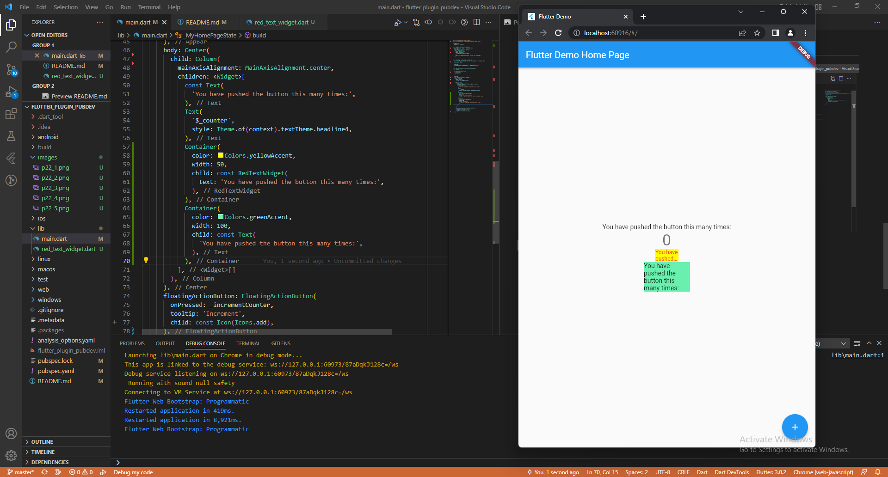

# flutter_plugin_pubdev

A new Flutter project.

# Praktikum 1: Buat Project Baru



Pada praktikum kali ini membuat project baru dengan nama flutter_plugin_pubdev

# Praktikum 2: Menambahkan Plugin



Pada praktikum kali ini menambahkan plugin auto_size_text dengan memasukkan syntax seperti berikut:

``` flutter pub add auto_size_text ```

# Praktikum 3: Buat file red_text_widget.dart



Pada praktikum kali ini membuat file baru dengan nama red_text_widget.dart. Pada file tersebut berisikan class RedTextWidget dengan menggunakan stateless widget

# Praktikum 4: Tambah Widget AutoSizeText



- Pada praktikum kali ini menambahkan widget AutoSizeText pada file red_text_widget.dart
- Kode tersebut mengalami error karena terdapat 'text' yang belum terdefinisi atau belum memiliki parameter dan juga text tersebut bukan termasuk parameter dari AutoSizeText

# Praktikum 5: Buat Variabel text dan parameter di constructor



Pada praktikum kali ini membuat variabel text dengan String dan parameter di constructor

# Praktikum 6: Tambahkan widget di main.dart



Pada praktikum kali ini menambahkan widget Container untuk menampung text

# Penjelasan Parameter dalam auto_size_text package 

| Parameter         | Description    |
| :---:             | :---:          |
| Key               | Mengontrol bagaimana satu widget dapat menggantikan widget lain pada pohon widget|
| textKey           | Mengatur kunci untuk widget Teks yang dihasilkan |
| style             | Bila dalam non-null, style ini bisa digunakan untuk teks |
| minFontSize       | ukuran minim teks dipaksa untuk digunakan ketika auto-sizing text (Akan diabaikan apabila presetFontSize di set) |
| maxFontSize       | ukuran max teks dipaksa untuk digunakan ketika auto-sizing text (Akan diabaikan apabila presetFontSize di set) |
| stepGranularity   | Langkah ketika ukuran font disesuaikan dengan batasan |
| presetFontSizes   | Mendefinisikan semua ukuran font yang memungkinkan |
| group             | Sinkronisasi ukuran dalam banyak AutoSizeTexts |
| textAlign         | Mengatur bagaimana teks harus disejajarkan secara horizontal |
| textDirection     | Arah untuk teks. Memutuskan bagaimana nilai textAlign seperti TextAlign.start dan TextAlign.end bila diinterupsikan |
| locale            | Digunakan untuk memilih font ketika karakter Unicode sama dapat di render secara berbeda, tergantung pada lokal |
| softWrap          | Apakah teks harus putus di garis lunak putus |
| wrapWords         | apakah kata yang tidak sesuai di satu garis harus dibungkus defaults untuk true berperilaku seperti text |
| overflow          | Bagaimana visual overflow harus di handel |
| overflowReplacement | jika text overflowing dan tidak cukup pada batasnya, widget ini ditampilkan sebagai gantinya |
| textScaleFactor   | Jumlah dari font piksel pada setiap piksel |
| maxLines          | Jumlah maksimum baris opsional untuk teks yang akan dibentangkan |
| semanticsLabel    | Label semantik alternatif untuk teks ini |